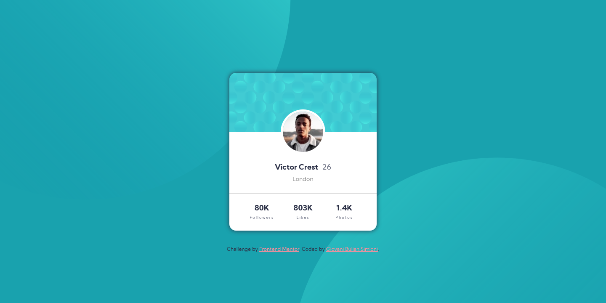

# Frontend Mentor - Profile card component solution

This is a solution to the [Profile card component challenge on Frontend Mentor](https://www.frontendmentor.io/challenges/profile-card-component-cfArpWshJ). Frontend Mentor challenges help you improve your coding skills by building realistic projects. 

## Table of contents

- [Overview](#overview)
  - [The challenge](#the-challenge)
  - [Screenshot](#screenshot)
  - [Links](#links)
- [My process](#my-process)
  - [Built with](#built-with)
  - [What I learned](#what-i-learned)
  - [Continued development](#continued-development)
  - [Useful resources](#useful-resources)
- [Author](#author)

## Overview

### The challenge

- Build out a profile card component to the designs provided

### Screenshot

- Desktop screenshot

- Mobile screenshot

### Links

- Live site URL: [https://giovanibulian.github.io/profile-card-component/](https://giovanibulian.github.io/profile-card-component/)

## My process

### Built with

- Semantic HTML5 markup
- CSS custom properties
- Flexbox Layout
- CSS Grid Layout
- Mobile-first workflow

### What I learned

- Background sizing and positioning with multiple background images
- CSS Grid Layout (basics)

### Continued development

I'd like to dive deeper into CSS Grid and also become more fluent in background manipulation. 

### Useful resources

- [CSS-Tricks.com comprehensive guide to CSS grid](https://css-tricks.com/snippets/css/complete-guide-grid/) - This guide is very illustrative and helped me a lot with CSS Grid Layout.
- [CSS background-image Tutorial by Kevin Powell](https://youtu.be/3T_Jy1CqH9k) - This video guide about background images really helped me with the `background-sizing` and `background-position` properties.

## Author

- GitHub - [Giovani Bulian Simioni](https://github.com/giovanibulian)